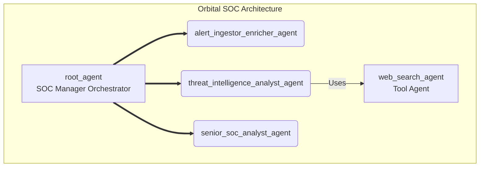

### **Orbital**

#### 1. Introduction & Vision

**Orbital** is an AI-driven, autonomous Security Operations Center (SOC) built on the Google ADK framework. 
Its vision is to address the core challenges of modern security operations: alert overload, analyst burnout, and the speed mismatch between automated attacks and manual human response. 
Orbital achieves this by autonomously managing the full lifecycle of a security alert, from initial detection and enrichment to deep-dive intelligence analysis, final judgment, and response recommendation, thereby freeing human analysts to focus on high-level threat hunting and complex incident response.

#### 2. System Architecture

Orbital utilizes a hierarchical, hub-and-spoke multi-agent architecture. This design promotes a clear separation of concerns, modularity, and a logical workflow orchestrated by a central "SOC Manager" agent.

*   **`root_agent`**: Orchestrator. Manages state and routes tasks.
*   **`alert_ingestor_enricher_agent`**: Fetches and performs basic enrichment on alerts.
*   **`threat_intelligence_analyst_agent`**: Performs deep-dive OSINT on external IoCs.
*   **`senior_soc_analyst_agent`**: Provides final judgment and response recommendations.

#### 3. Execution Environment

The application is structured into three main Python scripts for a clear separation of concerns:
*   `services.py`: Initializes all shared services (logging, memory, sessions).
*   `runner.py`: Contains the logic to execute a single, complete agent session.
*   `scheduler.py`: The main entry point that uses a scheduler to periodically trigger the runner.

**Future Improvements**

| Category | Improvement Suggestion | Benefit |
| :--- | :--- | :--- |
| **Workflow** | 1. Parallel Processing & Dynamic Routing | **Reduces analysis time** by running tasks concurrently and choosing the most relevant analyst for the job. |
| **Workflow** | 2. "Fast Lane" for Critical Alerts | **Accelerates response** to the most severe threats, minimizing potential impact. |
| **Capabilities** | 3. New `Vulnerability_Context_Analyst_Agent` | **Fills a major gap** by providing crucial internal context, leading to more accurate analysis of internal threats. |
| **Capabilities** | 4. Rationalize `threat_intelligence_analyst_agent` Tools | **Increases efficiency** and forces the agent to focus on high-value, synthesized intelligence rather than redundant data checks. |
| **Capabilities** | 5. Empower `senior_soc_analyst_agent` with Tools | **Closes the automation loop** by translating recommendations into tangible actions, moving towards a true SOAR capability. |
| **Intelligence** | 6. Robust Memory System (`save_memory` tool) | **Enables long-term learning** and context awareness, making the system smarter and faster over time. |
| **Intelligence** | 7. Human-in-the-Loop Feedback | **Ensures continuous improvement** and model accuracy by incorporating expert human validation. |
